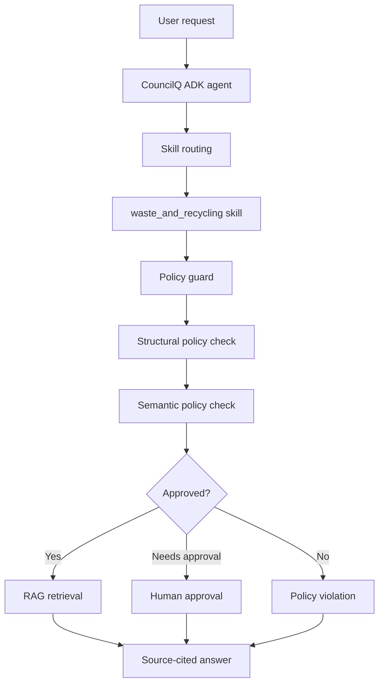

# Architecture

CouncilQ uses a single-agent architecture.

## Design Choices

- Single agent by default.
- Skills provide modular procedural knowledge.
- Retrieval provides factual grounding.
- Policies are centralized.
- Evals define behavior before implementation.

