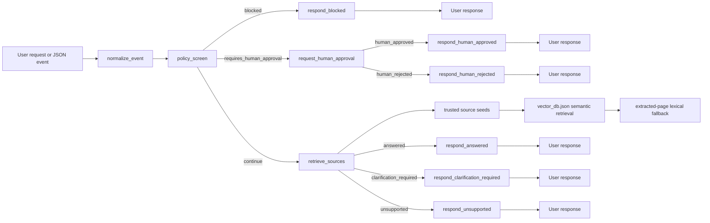

# Architecture

CouncilQ is a single advanced RAG assistant for City of Adelaide service questions. It is not a multi-skill agent. The system applies policy checks first, then retrieves trusted council source material, then renders a cited response or asks for clarification.

## Design Choices

- One assistant, one RAG pipeline.
- `normalize_event` accepts chat text, plain JSON `data`, and base64 Pub/Sub-style `data`.
- `policy_screen` runs before retrieval.
- Trusted URL seeds live in `data/seeds/trusted_sources.json`.
- PDF ingestion writes page-level JSON under `data/extracted/json/`.
- `vector_db.json` uses recursive character chunks with overlap, `thenlper/gte-small` embeddings, normalized vectors, cosine similarity, and preserved citation metadata.
- If no vector index exists, CouncilQ falls back to deterministic lexical matching over extracted page JSON records.
- Optional live page fetch is allowlisted and best-effort.
- Human approval uses ADK `RequestInput` and resumes through explicit approval/rejection routes.
- Quality gates are retrieval benchmarks, answer evals, and deterministic pytest coverage.
