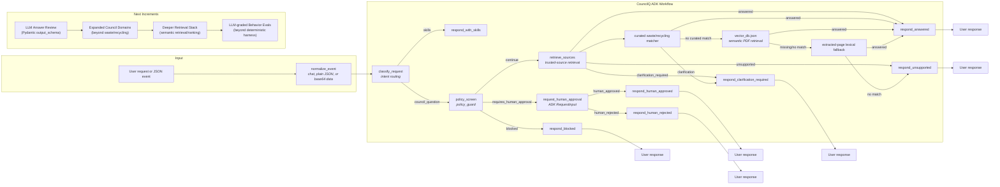

# Architecture

CouncilQ uses a single-agent ADK 2.0 workflow with modular Day 3 skills. The graph normalizes incoming chat or event payloads, classifies the request, applies policy checks, routes to deterministic trusted-source support for the current waste/recycling MVP, optionally searches an offline City of Adelaide PDF vector index, and renders a grounded response.

## Design Choices

- Single agent by default; skills provide modular, testable procedures.
- `normalize_event` accepts chat text, plain JSON `data`, and base64 Pub/Sub-style `data`.
- Current retrieval first applies deterministic trusted-source routing for MVP waste/recycling support.
- If curated waste/recycling sources do not match, CouncilQ searches `data/indexes/vector_db.json` when it exists.
- `vector_db.json` uses recursive character chunks with overlap, `thenlper/gte-small` embeddings, normalized vectors, cosine similarity, and preserved citation metadata.
- If no vector index exists, CouncilQ falls back to deterministic lexical matching over extracted page JSON records.
- Optional live page fetch is allowlisted and best-effort; if unavailable, CouncilQ falls back to curated trusted links.
- `policy_screen` runs before retrieval or any higher-risk workflow branch.
- Human approval uses ADK `RequestInput` and resumes through explicit approval/rejection routes.
- Workflow changes are covered by deterministic pytest checks; broader conversational behavior belongs in `agents-cli eval`.
